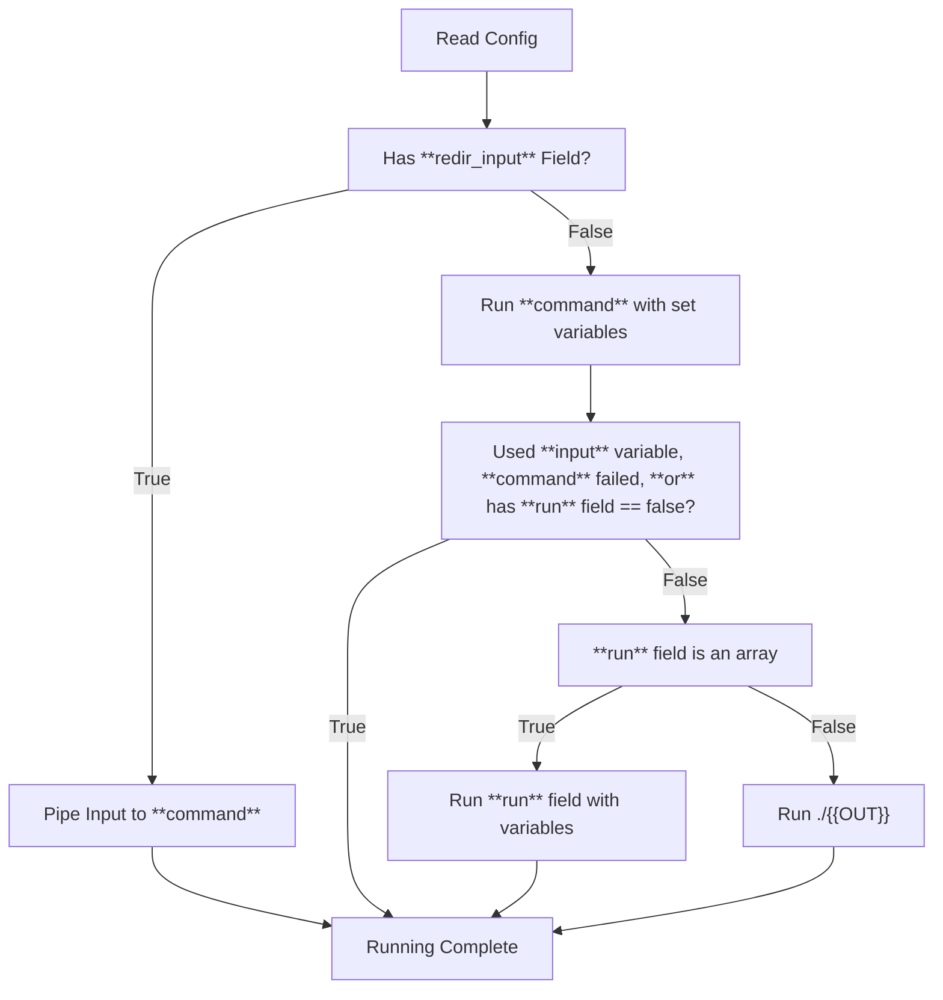

# Running your Config


## Language Features
By default, if your program is [Compiled](compiled-vs-interpreted.md#c-example-compiled), `QuickerMD` will infer that your program **needs** to be run.

When compiling certain languages, such as `C`, a normal workflow may look like the following:

```c
gcc main.c -o main
```

This would create an executable named `main`. In order to run your program, you would need to run the executable.

```sh
./main
```

In total, at *least* 2 commands are required for `C`.

However, for newer languages such as `Go` and `Rust`, just a single command is required.

Many of these languages offer support for running your program with just a single command.

```sh
# Rust
cargo run

# Go
go run main.go

# Python
python main.py

# Zig
zig run
```

For this reason, `QuickerMD` sets the default behavior to the diagram above, to determine if the command requires another for running.
